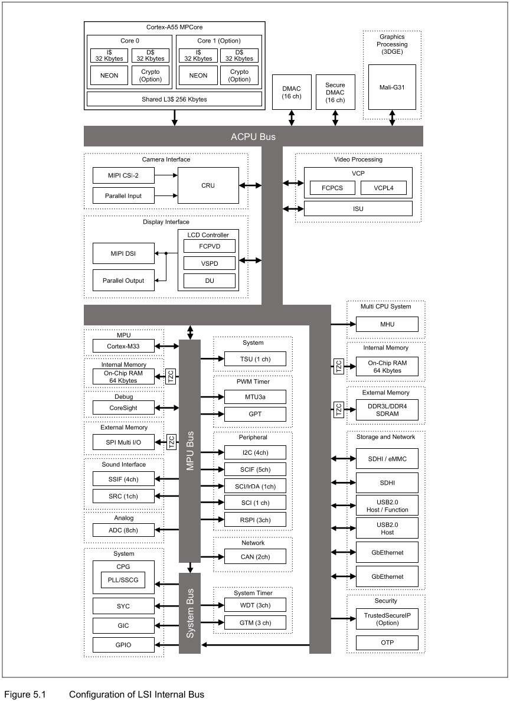
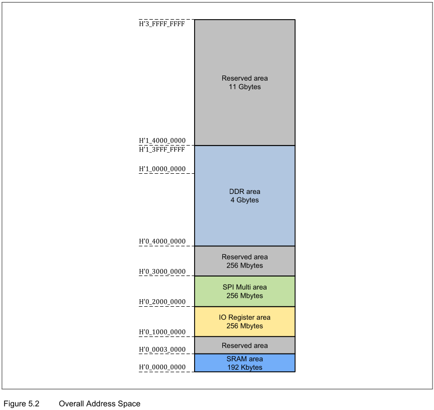
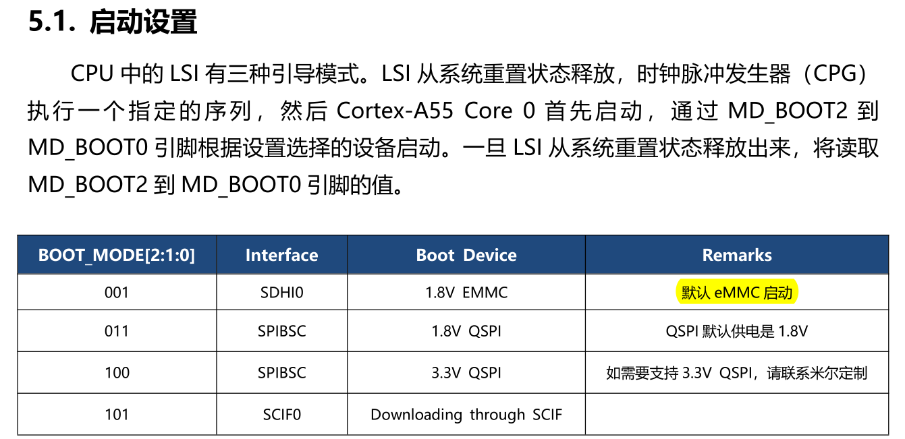

1. 根据手册安装完 SDK 后，需要执行该脚本，用来测试 SDK 环境变量是否正常。
``source /xxxxx/environment-setup-aarch64-poky-linux``

2. 内核编译指令（官方内核路径是 git@github.com:myir-private/myir-renesas-linux.git）
``` bash
▸ head Makefile  -n 6 # 查看内核版本号，为了同步 Documentation
# SPDX-License-Identifier: GPL-2.0
VERSION = 5
PATCHLEVEL = 10
SUBLEVEL = 83
EXTRAVERSION =
NAME = Dare mighty things


$ make distclean
$ make ARCH=arm64 defconfig
$ make ARCH=arm64 Image dtbs -j16 // 会生成 Image 和 dtb 文件

# 板载操作
# mount /dev/mmcblk0p1 /mnt/
# 将编译出来的 Image 文件和 dtb 文件放在 /mnt 目录下就可以了
```


3. RZ/G2L 核心
	
	
	* LSI Internal Bus (34 bit address 以及 16GB 内存空间)
		1. ACPU bus : A55
		2. MCPU bus : M33
		3. System bus : 
	* USB2.0 接口,包含1路 USB2.0 OTG/DRD(Host/Function)和1路 USB2.0 Host接口。
启动参数配置：


